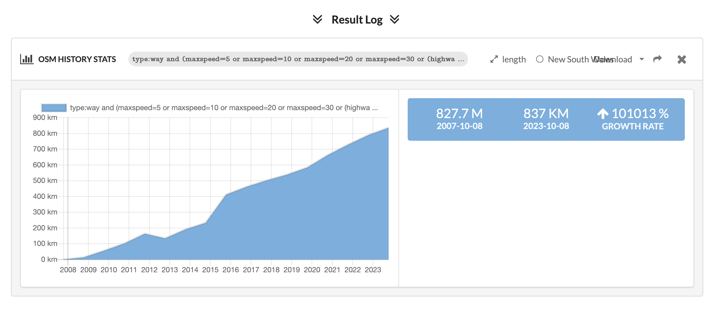
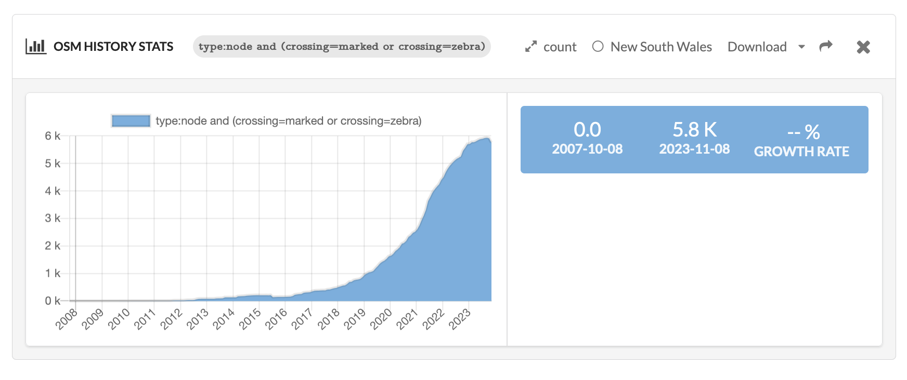

Australian Cycleway Stats
=========================

A website for comparing cycleway and safe street implementation across Australia!

See Overpass Turbo queries that power the stats in `static-backend/src/utils/overpass-queries.ts`.
Corrections or improvements very welcome.

# Architecture
- The `static-backend` code makes queries to Overpass Turbo (for OpenStreetMap data) and for Wikidata
  - It caches these Overpass Turbo responses
- It generates `frontend/src/data/data-by-council.json`
- The `frontend` code consumes this data and displays it in tabular format

See READMEs in the frontend and backend folders for further instructions on running.

## Notes on overpass queries
- Queries that contain `({{bbox}});` will run based on the current location you're viewing. If you pan/zoom the map and press run again you will get new data.
- Queries that include `map_to_area` will be locked to a particular `relation` (a specified boundary). You can search for these relations on OSM, for example the City of Sydney is https://www.openstreetmap.org/relation/1251066.

# Resources for Overpass Turbo requests
# Roads <=30kmh or living street (Overpass Turbo queries)

## In viewport

https://overpass-turbo.eu/s/1Eqj

```
[out:json][timeout:25];
(
  way["maxspeed"="5"]["highway"]({{bbox}});
  way["maxspeed"="10"]["highway"]({{bbox}});
  way["maxspeed"="20"]["highway"]({{bbox}});
  way["maxspeed"="30"]["highway"]({{bbox}});
  way["highway"="living_street"][!"maxspeed"]({{bbox}});
);

out geom;
```

## In council area

Where `1251066` is the OSM relation ID for the City of Sydney:

```
[out:json];
rel(1251066);map_to_area->.region;
(
  way(area.region)["maxspeed"~"^(5|10|20|30)$"]["highway"]["access"!="private"];
  way(area.region)["highway"="living_street"][!"maxspeed"]["access"!="private"];
);
out geom;
```

# Zebra crossings

## In NSW

- Work in progress: Counting how many, and by council

```

[out:json][timeout:25];
(
  rel(2316593);map_to_area
  ->.suburb;

  
  nwr["crossing"="marked"](area.suburb);
nwr["crossing"="zebra"](area.suburb);
  
);
out body;
>;
out meta qt;
```

https://overpass-turbo.eu/s/1E2I


## In viewport (faster)
https://overpass-turbo.eu/s/1E2E


```

[out:json][timeout:25];

nwr["crossing"="marked"]({{bbox}});
nwr["crossing"="zebra"]({{bbox}});

out geom;
```


# History



# How how number of <= 30kmh (or shared street) changed over time

- Notes:
  - OSM started in 2007 and coverage increased in years afterwards
  - Accuracy or coverage at a point in time could be estimated by graph of % of roads with a `maxspeed` as a ratio of all roads
  - Could calibrate based on 50/40km changes and school zone changes
- Todo: filter out ways that aren't roads (eg some railways)

```
type:way and (maxspeed=5 or maxspeed=10 or maxspeed=20 or maxspeed=30 or (highway=living_street and maxspeed!=*))
```

https://dashboard.ohsome.org/#backend=ohsomeApi&groupBy=none&time=2007-10-08T00%3A00%3A00Z%2F2023-11-11T22%3A00%3A00Z%2FP1Y&filter=type%3Away+and+%28maxspeed%3D5+or+maxspeed%3D10+or+maxspeed%3D20+or+maxspeed%3D30+or+%28highway%3Dliving_street+and+maxspeed%21%3D*%29%29&measure=length&adminids=-2316593


# Zebra crossings



- Caveats as above (on OSM history)

```
type:node and (crossing=marked or crossing=zebra)
```

https://dashboard.ohsome.org/#backend=ohsomeApi&groupBy=none&time=2007-10-08T00%3A00%3A00Z%2F2023-11-11T22%3A00%3A00Z%2FP1M&filter=type%3Anode+and+%28crossing%3Dmarked+or+crossing%3Dzebra%29&measure=count&adminids=-2316593

